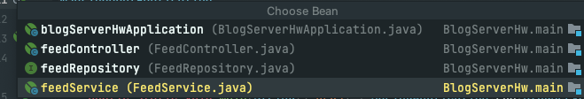

# springPrac
> spring 입문 연습 repo 입니다
* Spring Boot
* SQL
* JPA
* CRUD API
* AWS EC2, RDS


# BlogServerHW
> 로그인 기능이 없는 블로그 백엔드 서버 만들기
* API

* Usecase 
* 시스템과 사용자의 상호작용을 다이어그램으로 표현한 것으로, 사용자의 관점에서 시스템의 서비스, 기능, 외부와의 관계에 대해서 다이어그램으로 표현한 것을 말한다.
	
															
> 수정, 삭제 API의 request를 어떤 방식으로 사용하였는가?
* 수정API는 URL경로에 들어있는 id를 parameter로 전달 받고 FeedRequestDto로 전달받은 값을 body로 넣고 Request하였다.
* 삭제API는 URL경로에 들어있는 id를 parameter로 전달 받고 이 id로 Repository에 접근하여 해당 아이디 게시글 삭제
> 어떤 상황에 어떤 방식의 request를 써야할까?
* 전체 피드를 조회해올때는 GET방식으로 FeedList를 feedRepository를 거쳐 다 가져와서 보여주는 형식
* 피드 하나하나를 조회할때는 GET방식으로 id를 parameter로 전달받고 feedRepository를 거쳐 findbyid로 가져오는 형식
* 피드를 작성할때는 POST방식으로 FeedRequestDto에 먼저 넣어넣고 이것을 body로 받아 feedRepository를 거쳐 받아온 dto를 save하는 형식
* 게시글의 비밀번호를 확인할때는 POST방식으로 FeedRequestDto에 먼저 check할 password를 넣어넣고 이것을 body로 받아 feedRepository를 거쳐 받아온 password를 service클래스에서 비교를 한뒤 True/False를 리턴해주늗 형식
* Response를 보여줄때는 ResponseDto <T>으로 만들어서 success와 error 사이에 오는 data 값의 자료형의 자유도를 높여 처리 
> RESTful한 API를 설계했나요? 어떤 부분이 그런가요? 어떤 부분이 그렇지 않나요?
* HTTP의 요청에 대응해서 이 요청방식을 정확하게 채택했는지가 관건인데 일단 수정,삭제,확인하는 상황에대해서는 RESTful한 API를 작성했다 그래서 RESTful하다라고 말할수 있을거 같지만,
비밀번호를 확인하는 요청에대해서 어떤 방식을 채택하는 것이 더 올바른 것인가는 좀 더 고민이 필요하다. 현재는 정보를 가공하여(진위여부를 판단하여) 넘겨주기 때문에 POST방식으로 사용했다.

> 적절한 관심사 분리를 적용하였나요? (Controller, Repository, Service)
* Repository에서는 받아온 정보들을 DB에 저장하고 조회하는 기능을 수행한다. 따라서 게시글 조회와 저장의 용도로만 쓰일 수 있도록 했다.
* Controller도 따로 또 다른 Controller는 만들지는 않았다. Feed 테이블에 대해서만 요청을 처리하면 되기때문에 하나의 Controller로 API와 통하도록 설계
* Service에서는 두가지의 역할을 수행한다. 저장 조회 저장 기능 이외에 paswordcheck 그리고 게시글 update와 같은 기능은 Service에서 처리할수 있도록 설계하였다.
> 빈(Bean)
>
> 
* bean에 대해서는 아직 정확하게 이해하진 못했지만, 스프링이 관리하는 객체이고 나는 지금까지 진짜 많이 썼다라는 놀라운 사실
* 일단 테스트 코드할때 썼다라는 사실 따로 클래스를 만들어서 쓴다고 한다. 다음에는 그렇게 써봐야겠다.
```java
public CommandLineRunner demo(FeedRepository feedRepository) {
        return (args) -> {
    
            feedRepository.save(new Feed("titleTest", "author", "password", "commentTEST"));
            //bean

            
        };

}
```
